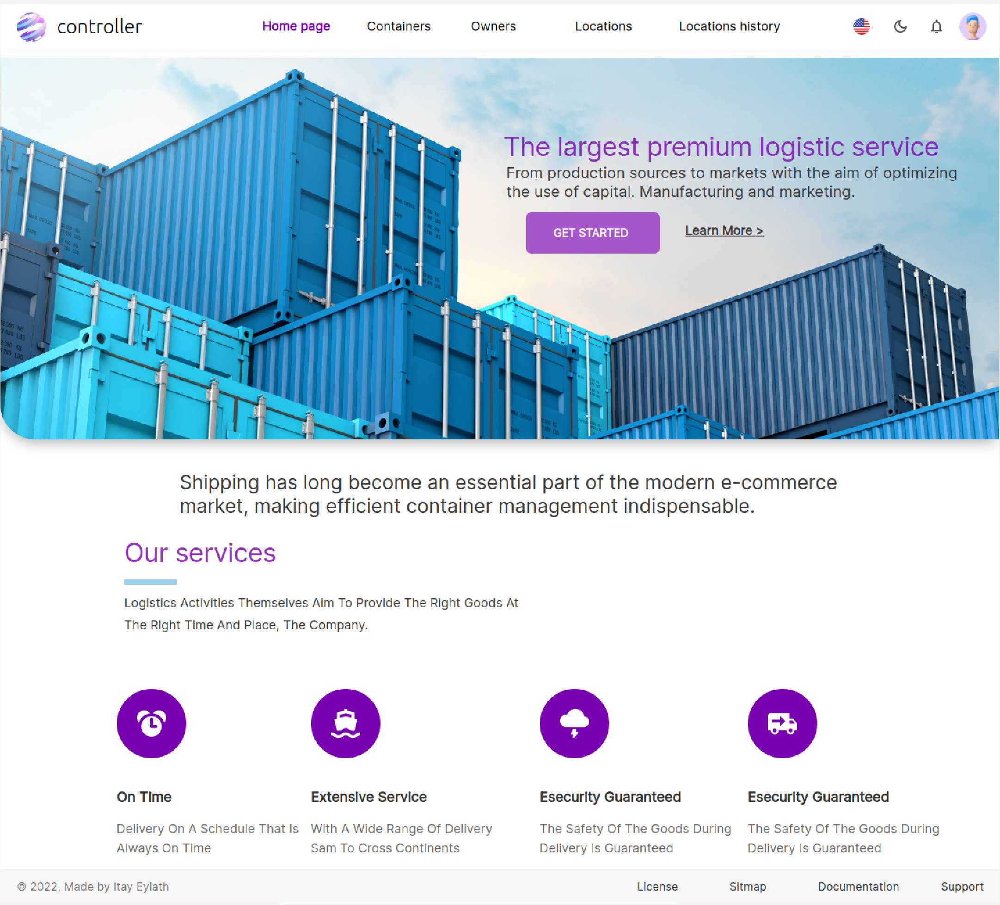
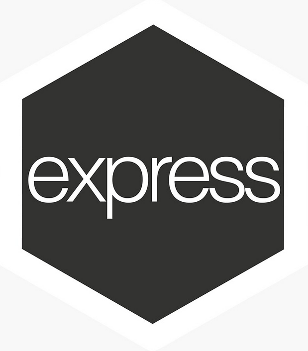
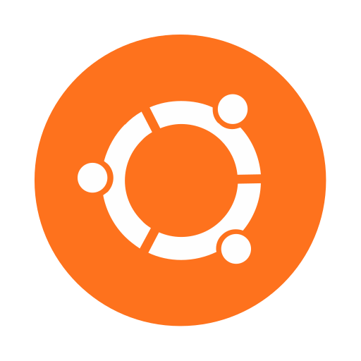

# Welcome to containers controller app
## [➡️ Open the app ⬅️](https://containers-controller.herokuapp.com/)

<b>Control the information about your 'containers'.</b>

Where are they, who owns them and more...

## About me
A combat officer (former) in the IDF.
Highly motivated junior full stack developer. 
Eager to learn and achieve great accomplishments in the industry.

## About the project
<b>so, why did I choose to do this project?</b>

I chose to do the project to implement my technological abilities as a full stack developer (the technologies I chose to use are shown below).

My goal in the project is-

* Clean code.
* Relevant comments.
* Relevant commits in Github.
* Organized file system.
* Use technologies correctly and understand them.
* After code review.
* <b>And the most important thing for me is a project that will improve all the time, to apply new technologies to it and refactor it.
</b>

## Links

### [Postman file](https://drive.google.com/file/d/1H_s2uHu04Fmtdj_yB1x7L04QjKloSf0p/view?usp=sharing)
### [Figma file](https://www.figma.com/file/aiyjjzTcmAqdZ6bbgtEiIz/Itay's-Project?node-id=0%3A1)

## Technologies
### Front-end
(TypesScript ,React, Scss, Figma HTML)

### Back-end
(TypesScript, Nodejs, Express, Postgresql, Postman)

### Misc
(Linux-ubuntu, Bash, Git, Heroku)

